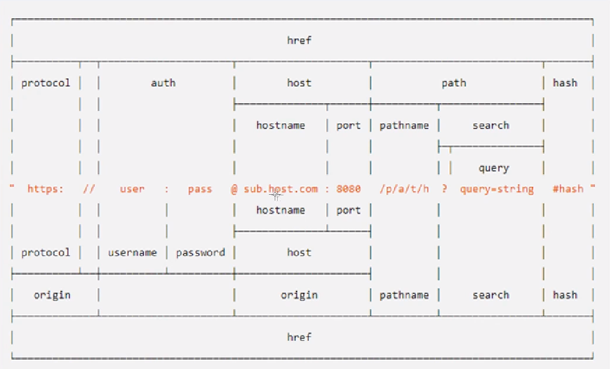

URL Module
===========

## URL Module


> 위쪽이 기존 방식의 주소 체계 (url.parse)
> 아래는 WHATWG 방식의 주소 체계 (url.URL)
> 노드는 둘다 지원을 하며, url.parse는 호스트가 없을 때도 쓸 수 있고, WHATWG 방식(url.URL)은 search 처리가 편리하다.

<pre><code>
audgn@HONG-PC MINGW64 /c/algorithm (master)
$ node var
new URL(): URL {
  href:
   'https://guide.luniverse.io/docs/wallet-bridge-%EC%9D%B4%EC%9A%A9%ED%95%98%EA%B8%B0',
  origin: 'https://guide.luniverse.io',
  protocol: 'https:',
  username: '',
  password: '',
  host: 'guide.luniverse.io',
  hostname: 'guide.luniverse.io',
  port: '',
  pathname: '/docs/wallet-bridge-%EC%9D%B4%EC%9A%A9%ED%95%98%EA%B8%B0',
  search: '',
  searchParams: URLSearchParams {},
  hash: '' }
url.format(): https://guide.luniverse.io/docs/wallet-bridge-%EC%9D%B4%EC%9A%A9%ED%95%98%EA%B8%B0
</code></pre>

> 노드 searchParams의 메서드는 FormData나 URLSearchParams 객체에도 비슷하게 쓰인다.

```javascript
example )

const url = require('url');

const URL = url.URL;
const myURL = new URL('https://search.naver.com/search.naver?where=nexearch&query=%ED%8A%B8%EC%99%80%EC%9D%B4%EC%8A%A4&ie=utf8&sm=tab_lve');

console.log('searchParams:', myURL.searchParams);

searchParams: URLSearchParams {
  'where' => 'nexearch',
  'query' => '트와이스',
  'ie' => 'utf8',
  'sm' => 'tab_lve' }

console.log('searchParams.getAll():', myURL.searchParams.getAll('category'));

searchParams.getAll(): []
-> getAll을 하면, category value가 합쳐서 출력됨.

console.log('searchParams.get():', myURL.searchParams.get('limit'));

searchParams.get(): null

console.log('searchParams.has():', myURL.searchParams.has('page'));

searchParams.has(): false

console.log('searchParams.keys():', myURL.searchParams.keys());

searchParams.keys(): URLSearchParams Iterator { 'where', 'query', 'ie', 'sm' }

console.log('searchParams.values():', myURL.searchParams.values());

searchParams.values(): URLSearchParams Iterator { 'nexearch', '트와이스', 'utf8', 'tab_lve' }

myURL.searchParams.append('filter', 'es3');  //  &filter=es3
myURL.searchParams.append('filter', 'es5');  //  &filter=es3&filter=es5
console.log(myURL.searchParams.getAll('filter'));

[ 'es3', 'es5' ]

myURL.searchParams.set('filter', 'es6');    //  기존에 있던 값을 지우고 set -> &filter=es6
console.log(myURL.searchParams.getAll('filter'));

[ 'es6' ]


console.log('searchParams.toString():', myURL.searchParams.toString());
myURL.search = myURL.searchParams.toString();

searchParams.toString(): where=nexearch&query=%ED%8A%B8%EC%99%80%EC%9D%B4%EC%8A%A4&ie=utf8&sm=tab_lve&filter=es6

-> filter가 추가된 URL로 출력됨.

myURL.searchParams.delete('filter');
console.log(myURL.searchParams.getAll('filter'));

[ ] 

console.log('searchParams.toString():', myURL.searchParams.toString());
myURL.search = myURL.searchParams.toString();

searchParams.toString(): where=nexearch&query=%ED%8A%B8%EC%99%80%EC%9D%B4%EC%8A%A4&ie=utf8&sm=tab_lve

-> filter가 삭제된 URL로 출력됨.
```

## TIPS

<pre><code>
https://search.naver.com/search.naver?where=nexearch&query=%ED%8A%B8%EC%99%80%EC%9D%B4%EC%8A%A4&ie=utf8&sm=tab_lve

기존 URL 방식은 (URL.parse)  동일한 도메인을 가질 경우

/search.naver?where=nexearch&query=%ED%8A%B8%EC%99%80%EC%9D%B4%EC%8A%A4&ie=utf8&sm=tab_lve

이처럼 생략된 URL로 표시될 수 있음.
이런 경우에는 url.URL (WHATWG) 방식을 사용할 수 없기 때문에
두가지 모두 사용되고 있음.
</code></pre>

