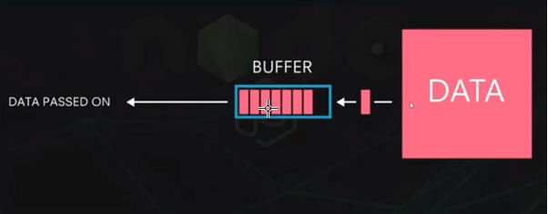
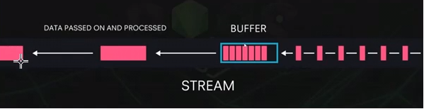

버퍼와 스트림
============

## Buffer


## Stream



```javascript
const fs = require('fs')

const readStream = fs.createReadStream('./writeme.txt', { highWaterMark: 16});
// 16byte를 채우면 읽고 16byte를 채우면 읽고
// 이러한 데이터를 chunk라고 한다.

const data = [];

readStream.on('data', (chunk) => {
data.push(chunk);
console.log('data', chunk, chunk.length);
});

readStream.on('end', () => {
console.log('end', Buffer.concat(data).toString());
// 위에 data 배열에 쌓인 chunk 데이터를 concat 메서드와 .toString으로 사람이 볼 수 있는 데이터로 합친다.
})

readStream.on('error', (err) => {
console.log('error', err);
});


audgn@HONG-PC MINGW64 /c/algorithm (master)
$ node stream.js
data <Buffer ec a0 80 eb 8a 94 20 ec a1 b0 ea b8 88 ec 94 a9> 16
data <Buffer 20 ec a1 b0 ea b8 88 ec 94 a9 20 eb 82 98 eb 88> 16
data <Buffer a0 ec 84 9c 20 ec a0 84 eb 8b ac eb 90 a9 eb 8b> 16
data <Buffer 88 eb 8b a4 2e 20 eb 82 98 eb 88 a0 ec a7 84 20> 16
data <Buffer ec a1 b0 ea b0 81 ec 9d 80 20 63 68 75 6e 6b eb> 16
data <Buffer 9d bc ea b3 a0 20 eb b6 80 eb a6 85 eb 8b 88 eb> 16
data <Buffer 8b a4 2e> 3
end 저는 조금씩 조금씩 나눠서 전달됩니다. 나눠진 조각은 chunk라고 부릅니다.
```

## writestream

```javascript
const fs = require('fs');

const writeStream = fs.createWriteStream('./writeme2.txt');

writeStream.on('finish', () => {
    console.log('파일 쓰기 완료');
});

writeStream.write('이 글을 씁니다. \n');
writeStream.write('한 번 더 씁니다.');
writeStream.end();

audgn@HONG-PC MINGW64 /c/algorithm (master)
$ node stream.js
파일 쓰기 완료
```

> 스트림은 버퍼의 흐름이기 때문에 여러 개의 스트림을 이어 버퍼가 흘러가게 할 수 있다.

```javascript
const fs = require('fs');

const readStream = fs.createReadStream('readme4.txt');
const writeStream = fs.createWriteStream('writeme3.txt');
readStream.pipe(writeStream);
```

## copyfile

```javascript
const fs = require('fs');

const readStream = fs.copyFile('./readme4.txt', './writeme4.txt', (err) => {
    console.log(err);
});

-> 내부적으로 Stream을 연결해주는 것과 비슷한 역할을 수행
```

## pipe

```javascript
const fs = require('fs');
const zlib = require('zlib');

const zlibStream = zlib.createGzip();
const readStream = fs.createReadStream('readme4.txt');
const writeStream = fs.createWriteStream('writeme3.txt');
readStream.pipe(zlibStream).pipe(writeStream);
```